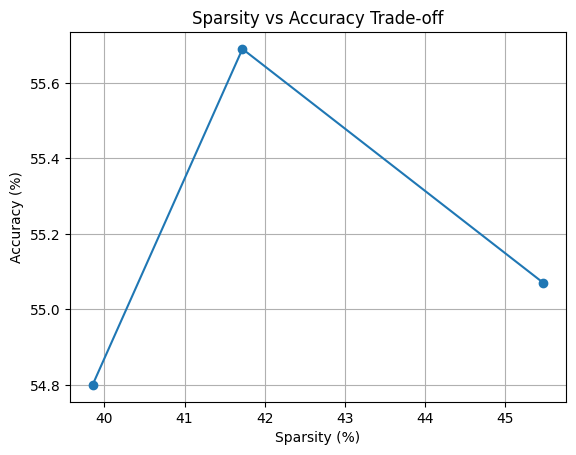
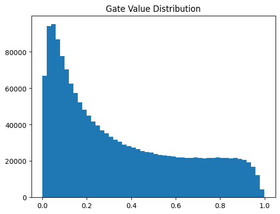

# 🚀Self-pruning-neural-n-w
Developed a self-pruning neural network using PyTorch that removes redundant neurons during training to reduce model size and computation. Implemented magnitude-based pruning to maintain accuracy while improving efficiency and faster inference.

## 🔑 Key Idea
Each weight is associated with a learnable gate:

$$
w_{eff} = w \cdot \sigma(\tau \cdot g)
$$

- g → learnable gate score

- τ → temperature scaling (sharpens pruning)
 
- Gate ≈ 0 → weight removed

- Gate ≈ 1 → weight kept

## 🧮 Loss Function

$$
L_{total} = L_{CE} + \lambda \cdot L_{sparsity}
$$

- CrossEntropy → classification  
- Sparsity Loss → encourages pruning

## ⚙️ Methodology

- Custom PrunableLinear layer (no torch.nn.Linear)  
- Gates applied during forward pass  
- L1-style regularization on gates  
- Lambda scheduling for stable pruning  

## 📊 Results

## Sparsity vs Accuracy

## Gate Distribution

## 🔍 Observations

- Increasing λ increases sparsity  
- High sparsity reduces accuracy  
- Clear trade-off between efficiency and performance  
- Temperature scaling enables near-binary gating  

## 💡 Key Insight

Standard sigmoid produces smooth gating, limiting pruning.  
Applying temperature scaling sharpens decisions and enables effective sparsity.

## 🛠️ Tech Stack

- Python  
- PyTorch  
- NumPy  
- Matplotlib

## 🚀 Future Work

- Extend to CNN architectures  
- Use L0 regularization (Hard Concrete gates)  
- Apply to real-world edge deployment  

